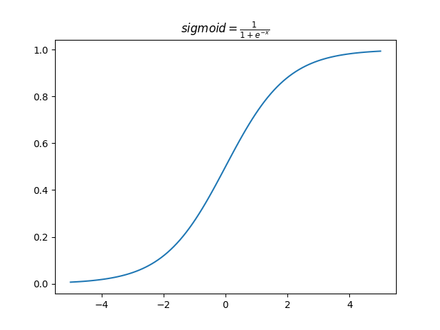
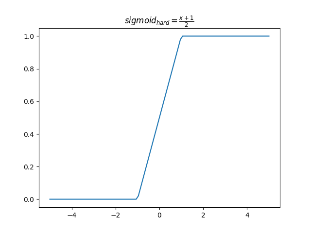
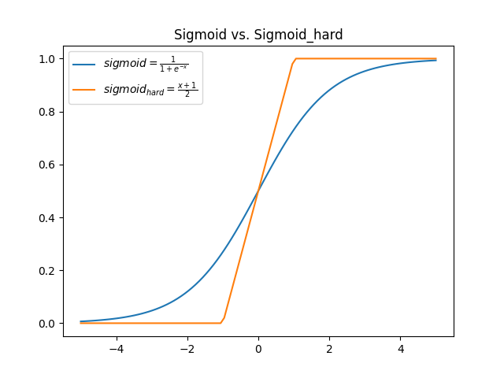
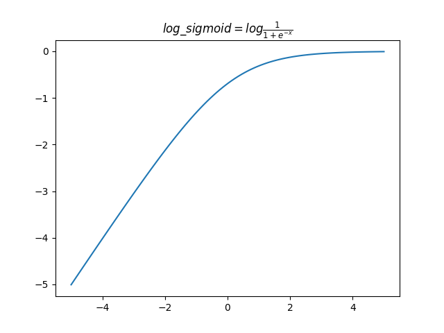

# activation

## 一、Sigmoid

1. 传统sigmoid

   由于包含幂运算和除法，计算量较大。但是函数平滑，易于求导。

$$
f(x)=\frac{1}{1+e^{-x}}
$$

2. hard_sigmoid

   Sigmoid的分段近似，由于没有使用指数计算，计算速度更快，但是非平滑。

$$
f(x)=clip(\frac{x+1}{2}, 0, 1)=max(0, min(1, \frac{x+1}{2}))
$$

- 如果$ x<= -1, f(x)=0 $；
- 如果$ x>=1, f(x)=1 $;
- 如果$ -1 < x < 1, f(x)=\frac{x+1}{2} $ 

   Sigmoid vs Sigmoid_hard:

## 二、Softmax

​	softmax函数常用在分类网络的最后一层，把网络输出转化为各类别的概率。
$$
f(x_i)=\frac{e^{x_i}}{\Sigma_{j=0}^ke^{x_j}}
$$
​	其中$ x_i $为第$i$类的预测值，$k$为类别个数。

​	通过Softmax函数就可以将多分类的输出值转换为范围在[0, 1]且和为1的概率分布。经过使用指数形式的Softmax函数能够将差距大的数值距离拉的更大。

## 三、log_logistic

​	对sigmoid函数计算的结果进一步取对数运算。函数值在$ [-\infty,0 ] $之间，输入值越大函数值距离0越近，在一定程度上解决了**梯度消失**问题。
$$
f(x)=log\frac{1}{1+e^{-x}}=-log(1+e^{-x})
$$

