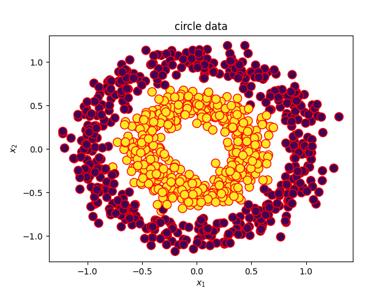
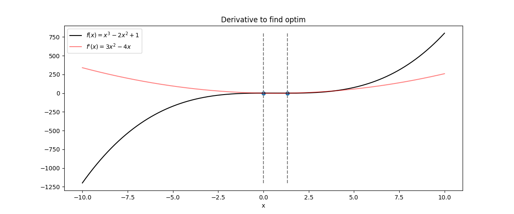
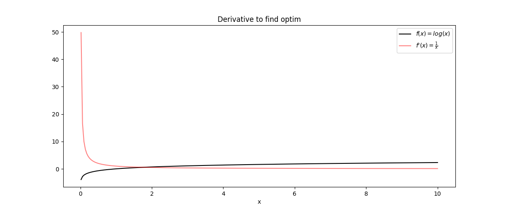

# 机器学习与微积分

## 一、Differential Calculus 微积分

### 1. 微分(Differentation)

​       微分是将一个数学函数转换为另一个数学函数的操作，称为导数(derivative)。 导数也可以看作函数的斜率或变化率。

- 例如，对于函数$f(x)=x^2$,其导数也可以看作关于$x$的一个函数，它反映了函数在$x​$处的变化率。

$$
f^{'}(x)=\frac{f(x+\Delta x)-f(x)}{\Delta x}
$$

​        这里$\Delta x $是一个很小的数。

​        通常我们会以极限的形式定义上述内容：

$$
f^{'}(x)=\lim_{\Delta x \to 0}\frac{f(x+\Delta x)-f(x)}{\Delta x}
$$

        这就意味着，$\Delta x $的均值尽可能接近于0。

- 有几个微分规则可以帮助我们更容易地找到导数。 

  - $f(x)=x^n,f^{'}(x)=nx^{n-1 } $

- 我们可以通过绘制根据变化率计算的函数和根据微分规则计算的函数来确认我们计算的微分结果，我个人比较喜欢用numpy和matplotlib来绘制。

  

> Code by python
> 
> ```python
> import numpy as np
> import matplotlib.pyplot as plt
> 
> # Define function f(x)
> def f(x):
>    return x ** 2
> 
> def plot(x):
>    # plot initial f(x)
>    plt.subplot(1,2,1)
>    plt.plot(x, f(x))
>    plt.xlabel("x")
>    plt.ylabel("y")
>    plt.title("$f(x)=x^2$")
> 
>    # f'(x) using the rate of change
>    plt.subplot(1, 2, 2)
>    delta_x = 0.0001
>    y1 = (f(x + delta_x) - f(x)) / delta_x
>    # f'(x) using the rule
>    y2 = 2 * x
>    # Plot f'(x) on right half of the figure
>    plt.plot(x, y1, "r-", label="handy")
>    plt.plot(x, y2, "b-.", label="$f(x)=2x$")
>    plt.title("derivative calculation")
>    plt.xlabel("x")
>    plt.ylabel("")
>    plt.legend()
> 
>    plt.suptitle("differentation")
>    plt.show()
> 
> if __name__ == "__main__":
>    x = np.linspace(-10, 10, 500)
>    plot(x)
> ```

## 二、Integration 积分

- 积分是微分的逆过程。考虑函数$f(x)=2x$，在步长step（$\delta x=0.1$）时，计算$x\in [-10,10]$

$$
f(-10), f(-9,9), ..., f(9.9), f(10)
$$

​    显然，如果step($\delta x$)越小, 上面计算的函数值就越多。如果我们将上述每一项与步长相乘，然后将它们相加，可以得到$f(x)$的积分：
$$
f(-10)\times 0.1+f(-9.9)\times 0.1+...+f(9.9)\times 0.1
$$

- 本质上，这个总和是$f(x)$曲线下的面积。微积分中的一个定理：如果我们把曲线下的面积作为一个函数$F(x)$，那么它的导数是$f(x)$ 。因此，我们可以将积分视为微分的反向操作。

- 例如，对于$f(x)=x^2$的导数为$f^{'}(x)=2x$，这意味着，对于函数$f(x)=2x$，我们可以写作$\int f(x)dx=x^2$或者我们可以说$f(x)=2x$的反导数是$x^2$。

```python
import numpy as np
import matplotlib.pyplot as plt

def f(x):
    return 2 * x

# Set up x from -10 to 10 with small steps
delta_x = 0.1
x = np.arange(-10, 10, delta_x)

# Find f(x) * delta_x
fx = f(x) * delta_x

# Compute the running sum
y = fx.cumsum()

# Plot
plt.plot(x, y)
plt.xlabel("x")
plt.ylabel("y")
plt.title("$f(x)=\int 2x = x^2$")
plt.show()
```


​    实际上，对于只有常数项不同的函数导数相同，例如$f(x)$和$f(x)+5$，对应的导数均为$f^{'}(x)$。因此，计算的反导数(积分)将是原始函数的垂直移动。

- 考虑$f(x)=3x^2-4x$，找到这个函数的反导数并绘制它

```python
import numpy as np
import matplotlib.pyplot as plt

def f(x):
    return 3 * x**2 - 4 * x

def antiderivative(f_x, delta_x, constant=0):
    fx = f_x * delta_x
    return fx.cumsum() + constant

# Set up x from -10 to 10 with small steps
delta_x = 0.1
x = np.arange(-2, 3, delta_x)

y = f(x)

antiderivative_value = antiderivative(y, delta_x)

plt.plot(x, antiderivative_value, "r-.")
plt.xlabel("x")
plt.title("$F(x)=\int 3x^2 - 4x dx$")
plt.show()
```


## 三、Gradient of a vector function 向量的梯度

### 1. 梯度的计算

​    如果我们有一个多变量的函数，则微分自然扩展为函数对每个变量的微分。例如，$f(x,y)=x^2+y^3$,我们分别对每个变量计算偏导数，可以得到：

$$
\frac{\partial f}{\partial x}=2x
$$

$$
\frac{\partial f}{\partial y}=3y^2
$$

> 偏导数：对一个函数中某一变量进行微分，同时假设其他变量是常数
> 
> 例如，上面示例的计算中，当我们计算 $\frac{\partial f}{\partial x}$时，我们忽略了$y^3$。

### 2. 函数可视化

​    具有两个变量的函数可以可视化为平面上的表面。

```python
import numpy as np
import matplotlib.pyplot as plt

# Define the range for x and y
x = np.linspace(-10, 10, 1000)
xv, yv = np.meshgrid(x, x, indexing='ij')

# Compute f(x,y) = x^2 + y^3
zv = xv ** 2 + yv ** 3

# Plot the surface
fig = plt.figure(figsize=(6, 6))
ax = fig.add_subplot(projection='3d')
ax.plot_surface(xv, yv, zv, cmap="viridis")
ax.set_xlabel('X')
ax.set_ylabel('y')
ax.set_title("$f(x,y)=x^2+y^3$")
plt.show()
```


### 3. 梯度的几何含义

​    该函数的梯度表示为：

$$
\nabla f(x,y)=(\frac{\partial f}{\partial x}, \frac{\partial f}{\partial y})=(2x,3y^2)
$$

​    因此，在每个坐标 $(x,y)$ 处，梯度 $\nabla f(x,y)$ 是一个向量。这个向量告诉我们两件事：

- 向量的方向指向函数 $f(x,y)$ 增长最快的地方
- 向量的大小是函数$f(x,y)$在这个方向上的变化率

### 4. 可视化梯度

​    可视化梯度的一种方法是将其视为**向量场**

- 平面中的矢量场可以可视化为具有给定大小和方向的箭头集合，每个箭头都连接到平面中的一个点。

- 若 f 为关于两个变量的标量函数，其梯度 ∇f 被定义为$ ∇f(x,y)=f_x(x,y)i+f_y(x,y)j $，因此 $∇f$ 为 ℝ2 上的向量场，被称为**梯度向量场**。

```python
import numpy as np
import matplotlib.pyplot as plt

# Define the range for x and y
x = np.linspace(-10, 10, 20)
xv, yv = np.meshgrid(x, x, indexing='ij')

# Compute the gradient of f(x,y)
fx = 2 * xv
fy = 2 * yv

# Convert the vector (fx,fy) into size and direction
size = np.sqrt(fx ** 2 + fy ** 2)
dir_x = fx / size
dir_y = fy / size

# Plot the surface
plt.figure(figsize=(6, 6))
# 绘制箭头
# 参数：X, Y, U, V, C
# X, Y 定义了箭头的位置, U, V 定义了箭头的方向, C 作为可选参数用来设置颜色
plt.quiver(xv, yv, dir_x, dir_y, size, cmap="viridis")
plt.colorbar()
plt.title("Vector Field")
plt.show()
```

​    

​    matplotlib 中的 viridis 颜色图，越接近黄色表示值较大，越接近紫色表示值越小。因此，在上图中，我们看到边缘处的梯度比中心处的梯度“更陡”。

​    对于$f(x,y)=x^2+y^3$，当前在点(2,3)处，当前的梯度向量计算如下：

```python
def find_best():
    # 考虑当前坐标，寻找梯度下降最快的方向
    # 0 to 360 degrees at 0.1-degree steps
    angles = np.arange(0, 360, 0.1)

    # coordinate to check
    # 假设当前在点(2,3)
    x, y = 2, 3

    # step size for differentiation
    step = 0.0001

    # To keep the size and direction of maximum rate of change
    # 遍历每个角度，找到梯度最大的角度
    maxdf, maxangle = -np.inf, 0
    for angle in angles:
        # convert degree to radian
        rad = angle * np.pi / 180
        # delta x and delta y for a fixed step size
        dx, dy = np.sin(rad) * step, np.cos(rad) * step
        # rate of change at a small step
        df = (f(x + dx, y + dy) - f(x, y)) / step
        # keep the maximum rate of change
        if df > maxdf:
            maxdf, maxangle = df, angle

    # Report the result
    dx, dy = np.sin(maxangle * np.pi / 180), np.cos(maxangle * np.pi / 180)
    gradx, grady = dx * maxdf, dy * maxdf
    print("===== calculate =====")
    print(f"Max rate of change at {maxangle} degrees")
    print(f"Gradient vector at ({x},{y}) is ({dx * maxdf},{dy * maxdf})")

    print("===== formula =====")
    print(f"Gradient vector at ({x},{y}) is ({2*x},{3*y**2})")

    print(f"tol = {abs(2*x - dx * maxdf) + abs(3*y**2 - dy * maxdf)}")
```

> Output:
> 
> ```sh
> ===== calculate =====
> Max rate of change at 8.4 degrees
> Gradient vector at (2,3) is (3.987419245872443,27.002750276227097)
> ===== formula =====
> Gradient vector at (2,3) is (4,27)
> tol = 0.015331030354654107
> ```

## 四、Jacobian 雅可比

​     函数 $f(x,y)=(p(x,y), q(x,y))=(2xy, x^2y)$ 是一个有两个输入和两个输出的函数。有时我们调用这个函数接受向量参数并返回一个向量值。这个函数的微分是一个称为雅可比矩阵。上述函数的雅可比是：

$$
J=\begin{bmatrix}\frac{\partial p}{\partial x} 
&\frac{\partial p}{\partial y} \ \frac{\partial q}{\partial x} 
& \frac{\partial q}{\partial y} 
\end{bmatrix}=\begin{bmatrix}2y 
&2x \ 2xy
 & x^2
\end{bmatrix}
$$

​      在雅可比矩阵中，每一行都有输出向量每个元素的偏微分，每一列都有关于输入向量每个元素的偏微分。

​    在 Python 中，我们可以使用 SymPy 验证上述结果：

```python
from sympy.abc import x, y
from sympy import Matrix, pprint, exp

# 对于f(x,y)=[2xy,x^2y]的雅可比矩阵的计算
f = Matrix([2*x*y, x**2*y])
variables = Matrix([x,y])
print("===Jacobian of f(x,y) = [2xy, x^2y]======")
pprint(f.jacobian(variables))
```

> 输出：
> 
> ```sh
> ===Jacobian of f(x,y) = [2xy, x^2y]======
> ⎡ 2⋅y   2⋅x⎤
> ⎢          ⎥
> ⎢        2 ⎥
> ⎣2⋅x⋅y  x  ⎦
> ```
> 
> - 我们让 SymPy 定义符号`x`，`y`然后定义向量函数`f`。之后，可以通过调用该`jacobian()`函数找到雅可比行列式
> 
> - **Sympy**是一个符号计算的Python库。它的目标是成为一个全功能的计算机代数系统，同时保持代码简洁、易于理解和扩展。它完全由Python写成，不依赖于外部库。SymPy支持符号计算、高精度计算、模式匹配、绘图、解方程、微积分、组合数学、离散数学、几何学、概率与统计、物理学等方面的功能。

​        对于以下函数：

$$
f(x,y)=\begin{bmatrix}\frac{1}{1+e^{-(px+qy)}} 
& \frac{1}{1+e^{-(rx+sy)}} & \frac{1}{1+e^{(-tx+uy)}} 
\end{bmatrix}
$$

其中 p,q,r,s,t,u 是常数。f(x,y) 的雅可比矩阵是什么:

$$
\begin{bmatrix}\frac{pe^{-(px+qy)}}{[1+e^{-(px+qy)}]^2} 
  &\frac{qe^{-(px+qy)}}{[1+e^{-(px+qy)}]^2}  \\
  \frac{re^{-(rx+sy)}}{[1+e^{-(rx+sy)}]^2}
  &\frac{se^{-(rx+sy)}}{[1+e^{-(rx+sy)}]^2} \\
  \frac{te^{-(tx+uy)}}{[1+e^{-(tx+uy)}]^2}
&\frac{ue^{-(tx+uy)}}{[1+e^{-(tx+uy)}]^2}
\end{bmatrix}
$$


## 五、Backpropagation 反向传播

​    如果我们考虑一个具有单隐藏层的神经网络，我们可以将其表示为一个函数：

$$
y=g(\sum_{k=1}^{M}u_kf_k(\sum_{i=1}^{N}w_{ik}x_i ) )
$$

- 神经网络的输入是一个向量 $\mathbf{x}=(x_1, x_2, \cdots, x_N)$，每个 $x_i$ 将乘以权重 $w_{ik}$ 并输入到隐藏层。

- 隐藏层神经元 $k​$ 的输出将乘以权重 $u_k​$ 并馈送到输出层。

- 隐藏层的激活函数和输出层的激活函数分别为$f$和$g$。

  

- 前向传播

  - 输入层->隐藏层，计算神经元$x_i$的加权和。

    $$
    net_{h1}=f(\sum_{i = 1}^{N}w_{i1}x_i)
    $$

    > 例如：x1=0.05， x2=0.1

  - 隐藏层->输出层，计算输出神经元的结果
    $$
    y=g(\sum_{k=1}^{M}u_kf(net_{h_k}) )
    $$

  

- 反向传播

  - **反向传播**（英语：**Backpropagation**，缩写为**BP**）是“**误差反向传播**”的简称，是一种与最优化方法（如梯度下降法）结合使用的，用来训练人工神经网络的常见方法。 该方法对网络中**所有权重**计算损失函数的梯度。 这个梯度会反馈给最优化方法，用来更新权值以最小化损失函数。（**误差**的反向传播）

    **反向传播的提出其实是为了解决偏导数计算量大的问题，利用反向传播算法可以快速计算任意一个偏导数。反向传播算法的思想和前向传播是一样的，只是一个反向的过程，推导过程中注意链式法则，一层扣一环即可求得结果。**

  - step

    - 计算误差，$\delta =y-\hat{y}$

      因为预测结果不一定是正确的，要和真实的标签$y$相比较，计算预测结果$\hat y$和真实标签$y$的误差

  - 目的：修正权值w

    损失：$L = \frac{1}{2}(y-\hat{y})^2 $

  - 计算总误差

- 如果考虑$z_k=f_k(\sum_{i=1}^{N}w_{ik}x_i )$，则

$$
\frac{\partial y}{\partial x_i} = \sum_{k = 1}^{M} \frac{\partial y}{\partial z_k} \frac{\partial z_k}{\partial x_i}
$$

​      如果我们一次考虑整个层，我们有 $\mathbf{z}=(z_1, z_2, \cdots, z_M)$ ，则可以得到：


$$
\frac{\partial y}{\partial x} = W^T \frac{\partial y}{\partial z}
$$

        其中$\mathbf{W}$ 是$M\times N$ Jacobian 矩阵，其中$k$ 行和$i$ 列上的元素是$\frac{\partial z_k}{\partial x_i}$。这就是反向传播算法在训练神经网络中的工作原理！<font color='red'>对于具有多个隐藏层的网络，我们需要计算每一层的雅可比矩阵。</font>

- 公式推导

  - 第L层$\delta$（输出层）的推导：

    - 先定义误差δ的一般形式
      $$
      \delta _j^{(l)}=\frac{\partial J(\theta)}{\partial z_j^{(l)}}
      $$

    - 对于输出层的误差推导
      $$
      \delta _j^{(L)}=\frac{\partial J(\theta)}{\partial z_j^{(L)}}
      =\frac{\partial J(\theta)}{\partial a_j^{(L)}} \frac{\partial a_j^{(L)}}{\partial z_j^{(L)}} 
      =\frac{\partial J(\theta)}{\partial a_j^{(L)}} g^{'}(z_j^{(L)})
      $$
      推广得到：
      $$
      \delta _j^{(l)}
      =\frac{\partial J(\theta)}{\partial a_j^{(l)}} g^{'}(z_j^{(l)})
      =\sum_{k=1}^{K} \frac{\partial J(\theta)}{\partial z_k^{(l+1)}} \frac{\partial z_k^{(l+1)}}{\partial a_j^{(l)}} g^{'}(z_j^{(l)})
      =\sum_{k=1}^{K}  \frac{\partial z_k^{(l+1)}}{\partial a_j^{(l)}}\delta _j^{(l+1)}g^{'}(z_j^{(l)})
      $$
      简化：$\delta^{(l)}=(\theta ^{(l)})^T\delta ^{(l+1)}g^{'}(z_j^{(l)})$

​	 **推导的时候需要记得前向传播中a(l)是如何通过权重矩阵编程z(l+1)的，然后z(l+1)通过激活函数又会变成a(l+1)，只要遵循这个就可以一步一步推导得出结果。**

- 对于激活函数为sigmoid，损失函数为交叉熵的反向传播
  $$
  \sigma(z)=\frac{1}{1+e^{-z}}
  $$

  $$
  Loss=-ylog\hat{y}-(1-y)log(1-\hat y)
  $$

  计算loss对于Sigmoid的偏导数：
  $$
  \frac{\partial{Loss}}{\partial{\sigma(z)}}= \frac{\sigma(z) - y}{\sigma(z) (1- \sigma(z))}
  $$
  由于$z=w^Tx$,$z$对于$\omega​$的导数：
  $$
  \frac{\partial \sigma}{\partial w}=\sigma(z)(1-\sigma(z))x
  $$
  

​	因此，可以到的loss对于$\omega ​$的导数：
$$
\frac{\partial{Loss}}{\partial{w}}= \frac{\sigma(z) - y}{\sigma(z) (1- \sigma(z))}\sigma(z)(1-\sigma(z))x=(\sigma(z) - y)x
$$
​	下面的代码实现了有两个隐藏层的一个分类网络，用于将二维中的点分成两类。尝试查看函数backward()并确定哪个是雅可比矩阵。

```python
"""
反向传播
"""
from sklearn.datasets import make_circles
from sklearn.metrics import accuracy_score
import matplotlib.pyplot as plt
import numpy as np

np.random.seed(0)

# Find a small float to avoid division by zero
epsilon = np.finfo(float).eps

# Sigmoid function and its differentiation
def sigmoid(z):
    return 1/(1+np.exp(-z.clip(-500, 500)))
def dsigmoid(z):
    s = sigmoid(z)
    return 2 * s * (1-s)

# ReLU function and its differentiation
def relu(z):
    return np.maximum(0, z)
def drelu(z):
    # print((z > 0).astype(float))
    return (z > 0).astype(float)

# Loss function L(y, yhat) and its differentiation
def cross_entropy(y, yhat):
    """二元交叉熵损失
        L = - y log yhat - (1-y) log (1-yhat)

    Args:
        y, yhat (np.array): nx1 matrices which n are the number of data instances
    Returns:
        average cross entropy value of shape 1x1, averaging over the n instances
    """
    return ( -(y.T @ np.log(yhat.clip(epsilon)) +
               (1-y.T) @ np.log((1-yhat).clip(epsilon))
              ) / y.shape[1] )

def d_cross_entropy(y, yhat):
    """ dL/dyhat """
    return ( - np.divide(y, yhat.clip(epsilon))
             + np.divide(1-y, (1-yhat).clip(epsilon)) )

class mlp:
    '''Multilayer perceptron using numpy 基于numpy实现的多层神经网络
    '''
    def __init__(self, layersizes, activations, derivatives, lossderiv):
        """remember config, then initialize array to hold NN parameters
        without init"""
        # 定义网络配置 hold NN config
        # 层数
        self.layersizes = tuple(layersizes)
        # 激活函数
        self.activations = tuple(activations)
        # 梯度
        self.derivatives = tuple(derivatives)
        # 损失函数
        self.lossderiv = lossderiv

        # parameters, each is a 2D numpy array
        L = len(self.layersizes)
        self.z = [None] * L
        self.W = [None] * L
        self.b = [None] * L
        self.a = [None] * L
        self.dz = [None] * L
        self.dW = [None] * L
        self.db = [None] * L
        self.da = [None] * L

    def initialize(self, seed=42):
        """
        初始化权重
        initialize the value of weight matrices and bias vectors with small random numbers.
        """
        np.random.seed(seed)
        sigma = 0.1
        for l, (n_in, n_out) in enumerate(zip(self.layersizes, self.layersizes[1:]), 1):
            self.W[l] = np.random.randn(n_in, n_out) * sigma
            self.b[l] = np.random.randn(1, n_out) * sigma

    def forward(self, x):
        """Feed forward using existing `W` and `b`, and overwrite the result
        variables `a` and `z`

        Args:
            x (numpy.ndarray): Input data to feed forward
        """
        self.a[0] = x
        for l, func in enumerate(self.activations, 1):
            # z = W a + b, with `a` as output from previous layer,
            # `W` is of size rxs and `a` the size sxn with n the number of data
            # instances, `z` the size rxn, `b` is rx1 and broadcast to each
            # column of `z`
            self.z[l] = (self.a[l-1] @ self.W[l]) + self.b[l]
            # a = g(z), with `a` as output of this layer, of size rxn
            self.a[l] = func(self.z[l])
        return self.a[-1]

    def backward(self, y, yhat):
        """back propagation using NN output yhat and the reference output y,
        generates dW, dz, db, da
        """
        # first `da`, at the output
        self.da[-1] = self.lossderiv(y, yhat)
        for l, func in reversed(list(enumerate(self.derivatives, 1))):
            # compute the differentials at this layer
            self.dz[l] = self.da[l] * func(self.z[l])
            self.dW[l] = self.a[l-1].T @ self.dz[l]
            self.db[l] = np.mean(self.dz[l], axis=0, keepdims=True)
            self.da[l-1] = self.dz[l] @ self.W[l].T

    def update(self, eta):
        """Updates W and b

        Args:
            eta (float): Learning rate
        """
        for l in range(1, len(self.W)):
            self.W[l] -= eta * self.dW[l]
            self.b[l] -= eta * self.db[l]

# Make data: Two circles on x-y plane as a classification problem
X, y = make_circles(n_samples=1000, factor=0.5, noise=0.1)
# plot initial data
plt.scatter(X[:,0],X[:,1],s=100,marker="o",edgecolors='r',c=y)
plt.xlabel("$x_1$")
plt.ylabel("$x_2$")
plt.title("circle data")
plt.show()

y = y.reshape(-1,1) # our model expects a 2D array of (n_sample, n_dim)

# Build a model
model = mlp(layersizes=[2, 4, 3, 1],
            activations=[relu, relu, sigmoid],
            derivatives=[drelu, drelu, dsigmoid],
            lossderiv=d_cross_entropy)

# initialize
model.initialize()

# predict
yhat = model.forward(X)

loss = cross_entropy(y, yhat)
score = accuracy_score(y, (yhat > 0.5))
print(f"Before training - loss value {loss} accuracy {score}")

# train for each epoch
n_epochs = 150
learning_rate = 0.005
for n in range(n_epochs):
    model.forward(X)
    yhat = model.a[-1]
    model.backward(y, yhat)
    model.update(learning_rate)
    loss = cross_entropy(y, yhat)
    score = accuracy_score(y, (yhat > 0.5))
    print(f"Iteration {n} - loss value {loss} accuracy {score}")
```

>`make_circles()`方法生成圆数据集，形成一个二维的大圆包含一个小圆。

- 原始数据

  


## 六、Optimization 优化

- 因为函数的微分是变化率，所以我们可以利用微分来找到函数的最优点。
- 如果想要到达函数的最大值，我们会期望它从一个较低的点移动到最大值，如果在到达最大值附近后进一步移动，它会下降到另一个较低的点。因此，在最大值点，函数的变化率为零。反之亦然。
- 例如，考虑$f(x)=x^3-2x^2+1$ ，导数是$f'(x)=3x^2-4x$。令$f'(x)=0$可以得到，$x=0$和$x=\frac{4}{3}​$。我们可以通过绘图直观地确认函数在何时取得了最大值或最小值。

```python
"""
梯度可以用来找到局部最优点
"""
import numpy as np
import matplotlib.pyplot as plt


# Define function f(x)
def f(x):
    return x**3 - 2 * x**2 + 1


# compute f(x) for x=-10 to x=10
x = np.linspace(-10, 10, 500)
y = f(x)

# f'(x) using the rate of change
delta_x = 0.0001
y_derivative = (f(x + delta_x) - f(x)) / delta_x

optim_point = [0, 4/3]

# Plot
fig = plt.figure(figsize=(12, 5))
plt.plot(x, y, 'k-', label="$f(x)=x^3-2x^2+1$")
plt.plot(x, y_derivative, c="r", alpha=0.5, label="$f'(x)=3x^2-4x$")
plt.scatter(optim_point, [0,0])
plt.vlines(optim_point, y.min(), y.max(), color='gray', linestyles='--')

plt.title("Derivative to find optim")
plt.xlabel("x")
plt.legend()

plt.show()
```



- 对于函数$f(x)=logx$,它的导数是什么。

```python
"""
梯度可以用来找到局部最优点
f(x)=log(x)的导数只能无限接近0
"""
import numpy as np
import matplotlib.pyplot as plt

# Define function f(x)
def f(x):
    return np.log(x)


# compute f(x) for x=-10 to x=10
x = np.linspace(-10, 10, 500)
y = f(x)

# f'(x) using the rate of change
delta_x = 0.0001
y_derivative = (f(x + delta_x) - f(x)) / delta_x


# Plot
fig = plt.figure(figsize=(12, 5))
plt.plot(x, y, 'k-', label="$f(x)=log(x)$")
plt.plot(x, y_derivative, c="r", alpha=0.5, label="$f'(x)= \\frac {1} {x}$")
# plt.vlines(optim_point, y.min(), y.max(), color='gray', linestyles='--')

plt.title("Derivative to find optim")
plt.xlabel("x")
plt.legend()

plt.show()
```



## 附录

### 弧度与角度的计算

#### - 角度

​        两条射线从圆心向圆周射出，形成一个夹角和夹角正对的一段弧。当弧长正好等于圆周长的360分之一时，两条射线的夹角的大小为1度。(单位: º）

#### - 弧度

​        两条射线从圆心向圆周射出，形成一个夹角和夹角正对的一段弧。当这段弧长正好等于圆的半径时，两条射线的夹角大小为1弧度（单位：rad)。
​        可简单理解为： 弧度 = 弧长 / 半径

> 弧长与弧度
> 
> - 圆的周长C的计算公式为：$C=2\pi r=\pi d$   (r是半径；d直径)
> 
> - 圆一周的弧长=圆的周长
> 
> - 圆一周的弧度=$\frac{2\pi r}{r}=2\pi $

#### - 弧度角度转换

​        $ \frac{角度}{360}=\frac{弧度}{2\pi} ​$

​	根据圆为360 º，弧度为2π，即 **360º = 2π** 

- 角度转弧度 

​            可以得到  ${\color{Red} {\LARGE 弧度=\frac{角度\times 2\pi}{360}=\frac{角度\times \pi}{180}  } } $

​            因此，可以得到1角度，对应$\pi/180=0.0174rad$

- 角度转弧度 
  
  ​    可以得到 ${\color{Red} {\LARGE 角度=\frac{360\times 弧度}{2\pi}=\frac{180\times 弧度}{\pi}   } } $

​            因此，可以得到1弧度，对应$\frac{180}{\pi}=57.29577角度$。