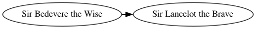

# Graphviz

​	Graph Visualization Software是一个由AT&A实验室启动的开源工具包，用于绘制DOT语言脚本描述的图形 。

​	DOT：一个用来将生成的图形转换成多种输出格式的命令行工具。其输出格式包括PostScript，PDF，SVG，PNG，含注解的文本等等。

## 一、 基本用法

### 1. 下载

```shell
pip install graphviz
```

### 2. 图创建

​	该graphviz模块提供了两个类：Graph和 Digraph。

​	它们分别以DOT语言为无向图和有向图创建图描述。它们具有相同的 API。通过实例化一个new Graph或 Digraphobject 创建一个有向图图形：

```python
>>> from graphviz import Digraph
>>> dot = Digraph(comment='The Round Table', format='png')
>>> dot

// The Round Table
digraph {
}
```

​	指定format参数，用于指定输出的文件格式

- 添加点

  ```python
  dot.node('B', 'Sir Bedevere the Wise')
  dot.node('L', 'Sir Lancelot the Brave')
  ```

  name：节点名

  label：节点标签

  通过不定参数，还可以添加关于节点其他属性。

- 添加边（tail_name -> head_name）

  ```python
  dot.edge(tail_name='B', head_name='L')
  ```

  

  tail_name: 有向图边的尾端

  head_name: 有向图边的顶端

- 查看绘图得到的 DOT

```sh
The generated DOT source code as string."
>>> dot.source

// The Round Table
digraph {
	B [label="Sir Bedevere the Wise"]
	L [label="Sir Lancelot the Brave"]
	B -> L [constraint=false]
}
```

- 保存图像

  通过`dot.render()`保存图像文件，并显示。通过设置view=True将自动使用系统默认的文件类型的查看器应用程序打开生成的文件（PDF，PNG，SVG等）。

```python
dot.render('test-output/round-table.gv', view=True)  
```

### 3. 图像style

​	使用graph_attr，node_attr和 edge_attr参数更改默认外观的图表，点和连接线。

- graph_attr

  ​	`dot.graph_attr['dpi'] = '300'`设定输出图像的dpi。

- ```python
  dot = Digraph(name='pet-shop', node_attr={'shape': 'plaintext'},format='png')
  dot.node('parrot')
  dot.node('dead')
  dot.edge('parrot', 'dead')
  dot.render('test-output/round-table.gv', view=True)
  ```


参考文档：https://www.cnblogs.com/shuqin/p/11897207.html

