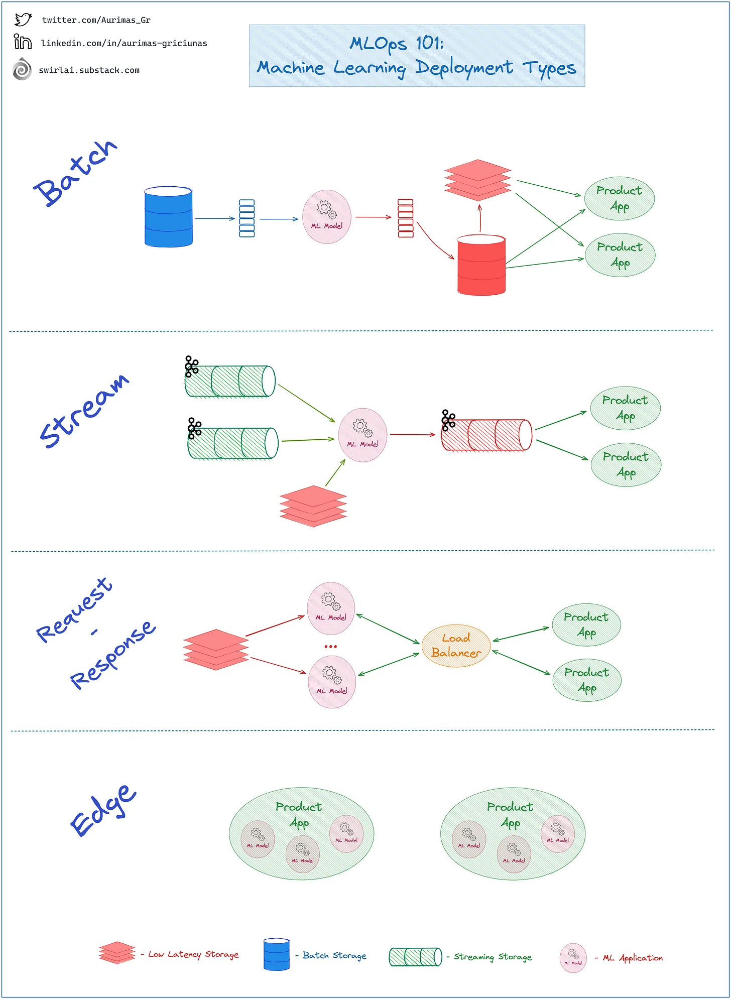

# MLOps 基础知识

## 一、ML Deployment Types

### 1.  Batch

- 在给定的时间表上将训练好的模型作为 𝗘𝗧𝗟/𝗘𝗟𝗧 𝗣𝗿𝗼𝗰𝗲𝘀𝘀 的一部分应用
- 从批存储中加载所需的特征，应用推理并将推理结果保存到批存储中
- 推理结果将加载到一个实时存储中，用于实时应用。

### 2.  𝗘𝗺𝗯𝗲𝗱𝗱𝗲𝗱 𝗶𝗻 𝗮 𝗦𝘁𝗿𝗲𝗮𝗺 𝗔𝗽𝗽𝗹𝗶𝗰𝗮𝘁𝗶𝗼𝗻 内嵌入到流应用中

- 将训练好的模型应用于𝗦𝘁𝗿𝗲𝗮𝗺𝗣𝗶𝗽𝗲𝗹𝗶𝗻𝗲的一部分
- 当数据不断通过您的 𝗦𝘁𝗿𝗲𝗮𝗺𝗶𝗻𝗴 𝗗𝗮𝘁𝗮 𝗣𝗶𝗽𝗲𝗹𝗶𝗻𝗲𝘀 时，具有加载模型的应用程序会不断对数据应用另一个推理并将其返回到流系统。
- 这种部署类型很可能涉及实时 𝗙𝗲𝗮𝘁𝘂𝗿𝗲 𝗦𝘁𝗼𝗿𝗲 𝗔𝗣𝗜 以检索其他静态功能以用于推理。
- 推理结果供订阅𝗜𝗻𝗳𝗲𝗿𝗲𝗻𝗰𝗲 𝗥𝗲𝘀𝘂𝗹𝘁𝘀 𝗦𝘁𝗿𝗲𝗮𝗺 的多个应用程序使用。

### 3. Request-Response

- 将模型公开为后端服务
- API 服务从 𝗥𝗲𝗮𝗹 𝗧𝗶𝗺𝗲 𝗙𝗲𝗮𝘁𝘂𝗿𝗲 𝗦𝘁𝗼𝗿𝗲 𝗔𝗣𝗜 检索推理所需的特征。
- 任何应用程序都可以实时请求推理，只要它能够形成符合𝗔𝗣𝗜𝗖𝗼𝗻𝘁𝗿𝗮𝗰𝘁的正确请求

### 4. Edge

- 将经过训练的模型直接嵌入到在用户设备上运行的应用程序中
- 此方法提供最低延迟并提高隐私性
- 数据很可能必须产生于设备内部